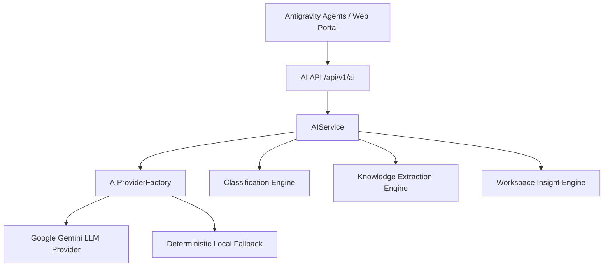

# AI Intelligence Architecture Guide

## Overview
The AI Intelligence Layer provides multi-provider LLM abstraction, automated memory classification, entity extraction, workspace insights, and dynamic prompt optimization for Agent 3 (Memory Agent).

---

## Architecture Diagram

---

## Supported AI Provider Abstraction

All providers implement `LLMProvider` (`apps/api/src/config/ai-provider.interface.ts`):
- **Google Gemini**: Primary text & embedding provider (`gemini-1.5-flash`, `text-embedding-004`).
- **Local Fallback**: Deterministic hash-based vector generator for zero-latency offline execution.

---

## API Endpoints

- `POST /api/v1/ai/classify`: Automated memory category classification and confidence scoring.
- `POST /api/v1/ai/extract`: Extraction of technologies, dates, decisions, and tasks.
- `GET /api/v1/ai/insights`: Workspace memory distribution analysis and recommendations.
