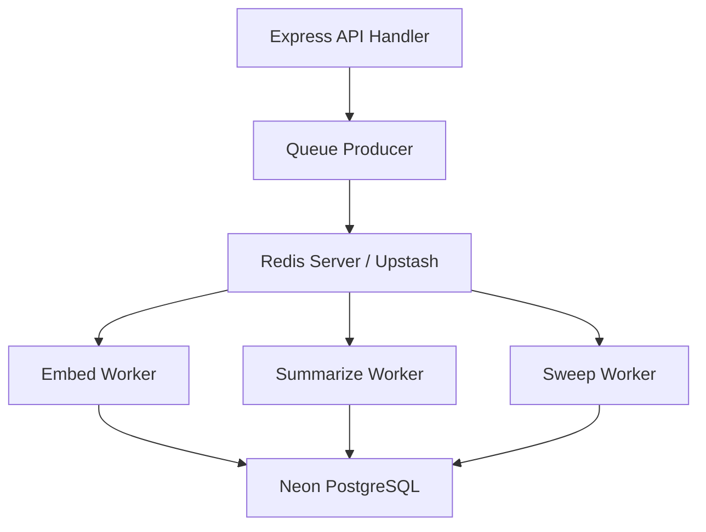

# Background Processing Platform Architecture Guide

## Overview
The Background Processing Platform offloads asynchronous tasks (vector embedding generation, conversation summarization, and TTL memory cleanup sweeps) to BullMQ queues powered by Redis.

---

## BullMQ Queue Architecture

---

## Queues & Workers Overview

- **`embedQueue`**: Enqueues vector embedding jobs using Gemini `text-embedding-004` (Worker: `apps/api/src/jobs/embed.worker.ts`).
- **`summarizeQueue`**: Enqueues conversation summarization tasks (Worker: `apps/api/src/jobs/summarize.worker.ts`).
- **`sweepQueue`**: Enqueues memory expiration cleanup tasks (Worker: `apps/api/src/jobs/sweep.worker.ts`).

---

## Endpoints

- `GET /api/v1/queues/status`: Check active queue health metrics and job counts.
- `POST /api/v1/queues/trigger-workflow`: Trigger sequential background task workflows.
