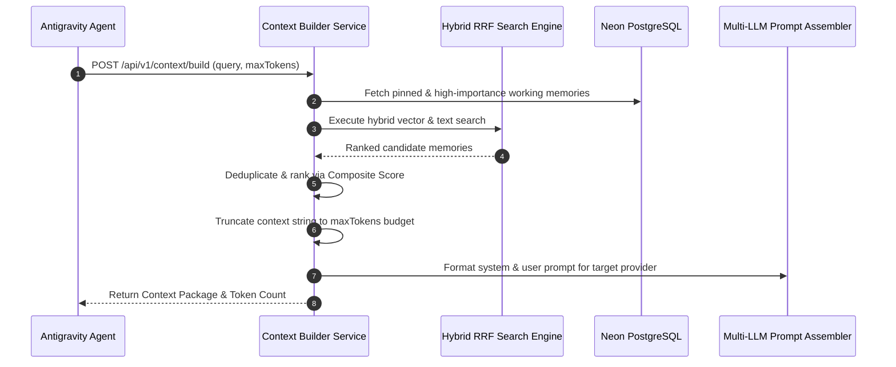

# Context Builder & Memory Orchestration Engine

## Overview
The Context Builder & Memory Orchestration Engine compiles, ranks, deduplicates, and truncates relevant workspace memories into an optimized context package for LLM inference requests across multi-agent workflows.

---

## Context Pipeline Flow

---

## Composite Context Scoring Formula

$$\text{ContextScore} = 0.5 \times \text{Relevance} + 0.3 \times \text{Importance} + 0.2 \times \text{Recency} + \text{PinnedBoost}$$

---

## Endpoints

- `POST /api/v1/context/build`: Dynamic context compilation with token budget enforcement.
- `POST /api/v1/context/assemble-prompt`: Construct provider-specific prompts (Gemini, OpenAI, Claude, Ollama).
- `GET /api/v1/context/analytics`: Context build performance, average token counts, and latency statistics.
