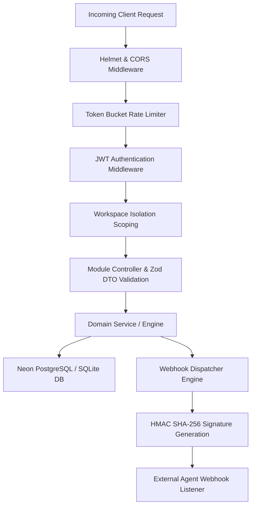

# Enterprise API Platform & Webhook Architecture Guide

## Overview
The Enterprise API Platform exposes REST, MCP JSON-RPC, and Webhook dispatching for the Memory Agent (Agent 3 - Antigravity Multi-Agent Platform).

---

## API Request Pipeline

---

## Webhook Dispatching & HMAC Verification

When memory events occur (`memory.created`, `memory.updated`, `context.built`), webhooks are dispatched with an HTTP header containing an HMAC SHA-256 signature generated using the endpoint's secret key:

$$\text{Header}: \text{X-Antigravity-Signature} = \text{HMAC-SHA256}(\text{Payload}, \text{Secret})$$

---

## Webhook Endpoints

- `POST /api/v1/webhooks/register`: Register external webhook URL and event filters.
- `GET /api/v1/webhooks`: List active webhooks for workspace.
