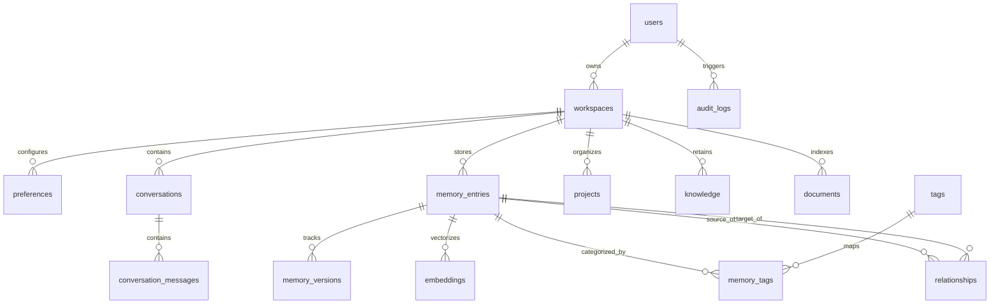

# Entity Relationship Diagram

```mermaid
erDiagram
    users ||--o{ workspaces : owns
    workspaces ||--o{ preferences : configures
    workspaces ||--o{ conversations : contains
    workspaces ||--o{ memory_entries : stores
    workspaces ||--o{ projects : organizes
    workspaces ||--o{ knowledge : retains
    workspaces ||--o{ documents : indexes

    conversations ||--o{ conversation_messages : contains

    memory_entries ||--o{ memory_versions : tracks
    memory_entries ||--o{ embeddings : vectorizes
    memory_entries ||--o{ memory_tags : categorized_by
    tags ||--o{ memory_tags : maps

    memory_entries ||--o{ relationships : source_of
    memory_entries ||--o{ relationships : target_of

    users ||--o{ audit_logs : triggers
```
