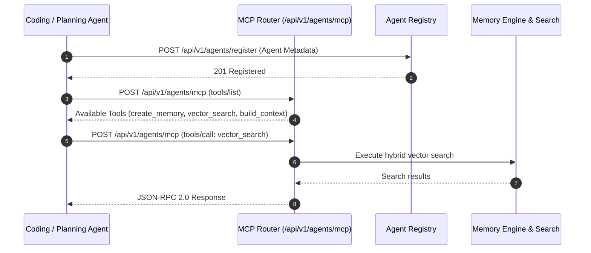

# Agent Communication & MCP Integration Architecture Guide

## Overview
The Agent Communication Platform provides dynamic Agent Registration, Heartbeat Tracking, and Model Context Protocol (MCP) JSON-RPC Tool Execution for all agents in the Antigravity Multi-Agent Platform (Agent 1 to Agent N).

---

## MCP Architecture Diagram

---

## MCP JSON-RPC Protocol Endpoints

- `POST /api/v1/agents/register`: Dynamic agent capability registration.
- `POST /api/v1/agents/heartbeat`: Health check & heartbeat keepalive.
- `GET /api/v1/agents`: List all online platform agents in workspace.
- `POST /api/v1/agents/mcp`: Standard MCP JSON-RPC 2.0 handler (`tools/list`, `tools/call`).
