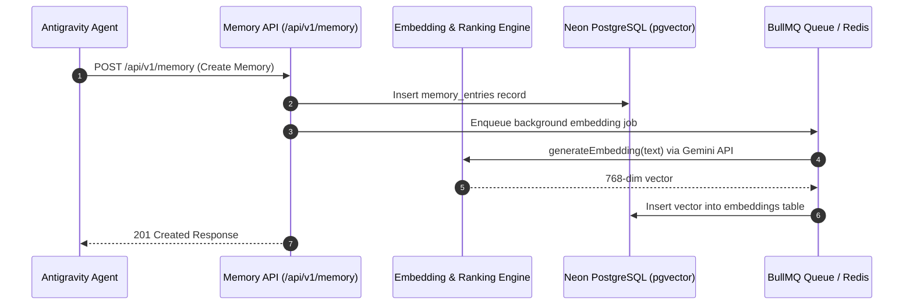

# Memory Engine Architecture & Lifecycle Guide

## Overview
The Memory Engine (Agent 3) serves as the primary cognitive memory bank for the Antigravity Multi-Agent Platform. It handles memory ingestion, vector embedding, Reciprocal Rank Fusion (RRF) hybrid search, dynamic context building, memory versioning, and graph relationships.

---

## Memory Types & Storage Strategy

| Memory Type | Lifecycle & TTL | Indexing & Retrieval |
| :--- | :--- | :--- |
| **`long_term`** | Permanent persistence | Vector + Keyword RRF search |
| **`short_term`** | Expiration via TTL sweep worker | Temporal window retrieval |
| **`working`** | Active agent workspace memory | Priority boosting + Pinned priority |
| **`conversation`**| Message stream context | Summarization engine pipeline |
| **`project`** | Scoped workspace project memory | Cross-reference linking |
| **`knowledge`** | Structured reference knowledge | Category taxonomy search |
| **`semantic`** | Vector embedding vectors | 768-dimensional cosine distance |
| **`archived`** | Preserved historical state | Direct filter inspection |

---

## Memory Lifecycle Flow

---

## Ranking Score Equation

Context memory relevance is calculated using composite scoring:

$$\text{FinalScore} = 0.5 \times \text{Relevance} + 0.3 \times \text{Importance} + 0.2 \times \text{Recency} + \text{PinnedBoost}$$

Where:
- $\text{Relevance}$: Cosine similarity or RRF search score $[0, 1]$
- $\text{Importance}$: User/agent specified significance $[0, 1]$
- $\text{Recency}$: Time-decay factor $\frac{1}{1 + \Delta t}$
- $\text{PinnedBoost}$: $+0.5$ if `pinned == true`

---

## Export & Import Formats

Memory exports are supported via `GET /api/v1/memory/export`:
- **JSON**: Full database objects representation
- **Markdown**: Formatted documentation for reading
- **CSV**: Spreadsheet data analysis
