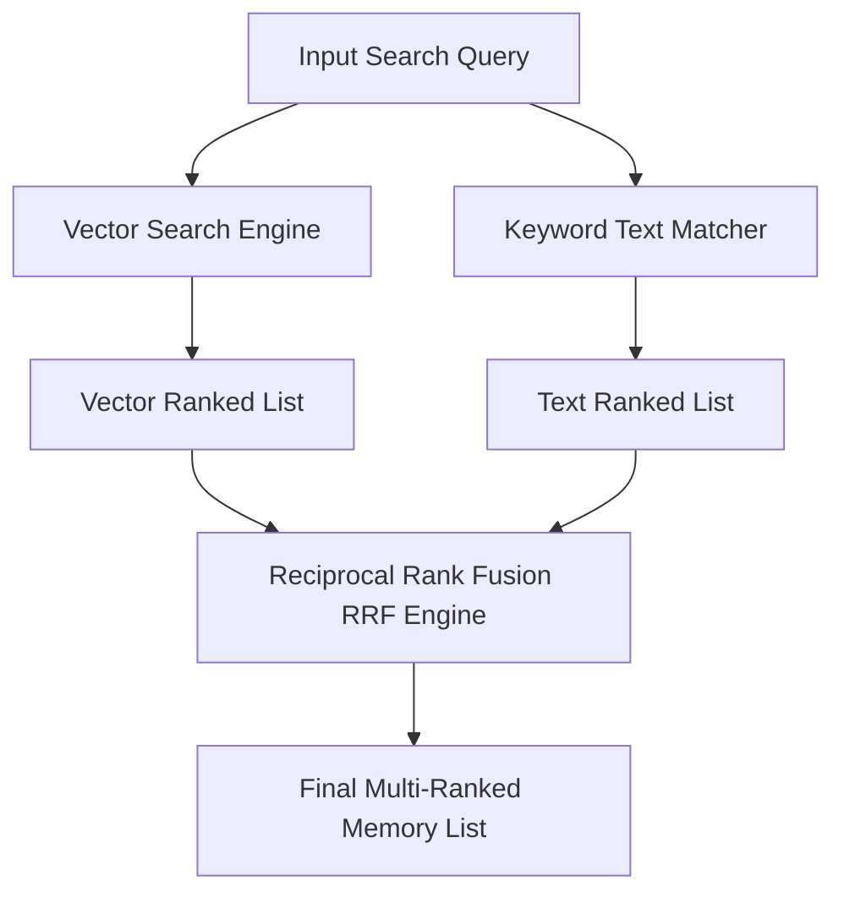

# Enterprise Search & Retrieval Engine Architecture

## Overview
The Search & Retrieval Engine for Agent 3 provides hybrid search capabilities combining PostgreSQL `pgvector` / SQLite cosine vector similarity search with traditional text keyword search via Reciprocal Rank Fusion (RRF).

---

## Hybrid RRF Ranking Pipeline

### RRF Formula

$$RRF\_Score(d) = \sum_{m \in M} \frac{1}{k + r_m(d)}$$

Where:
- $M$: Search methods (`[text_search, vector_search]`)
- $k$: Smoothing constant (default $k = 60$)
- $r_m(d)$: Rank position of memory document $d$ in method $m$

---

## Autocomplete & Analytics API Endpoints

- `GET /api/v1/search/autocomplete?q=...`: Real-time autocomplete suggestions for memory titles and tags.
- `GET /api/v1/search/history`: Workspace user query search history trail.
- `GET /api/v1/search/analytics`: Search latency metrics, total volume, and top queried search terms.
- `POST /api/v1/search/saved`: Save workspace query filter presets.
