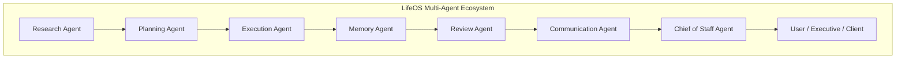

# LifeOS Communication Agent - Architecture & System Design

The **LifeOS Communication Agent** is the final presentation and communication layer of the LifeOS multi-agent ecosystem. It transforms validated technical JSON payloads generated by upstream agents into human-readable, executive-ready communications across multiple target destinations, tones, document lengths, and languages.

---

## 🔄 LifeOS Agent Inter-Communication Workflow



---

## 🏗️ Clean Architecture Layers

```
comunication-agent/backend/
├── app/
│   ├── api/             # HTTP Controllers & Route Aggregators
│   ├── authentication/  # PBKDF2 Password Hasher & JWT Access/Refresh Token Engine
│   ├── ai/              # Gemini 2.5 Flash SDK, REST Client, & System Prompt Templates
│   ├── config/          # Pydantic Settings (.env loading)
│   ├── controllers/     # Controller Layer (Auth & Communication Handlers)
│   ├── database/        # Async SQLAlchemy Engine, Session Factory, Base Model
│   ├── middleware/      # Security Headers, Rate Limiting, & Exception Handlers
│   ├── models/          # 11 SQLAlchemy Models (User, Communication, Report, Email, etc.)
│   ├── repositories/    # Data Access Layer (UserRepository, HistoryRepository, etc.)
│   ├── routes/          # Fast API Router Enpoints (/auth, /communication)
│   ├── services/        # Service Layer (TransformationService, Auth, Fallback Engine)
│   └── utils/           # Centralized Logger (Rotating File Logger)
```

---

## 🛡️ Zero-Hallucination Pipeline Flow

```
[Inbound Agent JSON] ──► [Schema Validation] ──► [Prompt Injection Safety Check]
                                                            │
[Document Generation] ◄── [Gemini 2.5 Flash / Fallback] ◄───┘
         │
         ├──► [JSON Output Parser]
         ├──► [Missing Context Inspector]
         ├──► [Database Persistence (SQLAlchemy)]
         └──► [Multi-Format Exporter (MD, HTML, PDF, DOCX, Email)]
```
